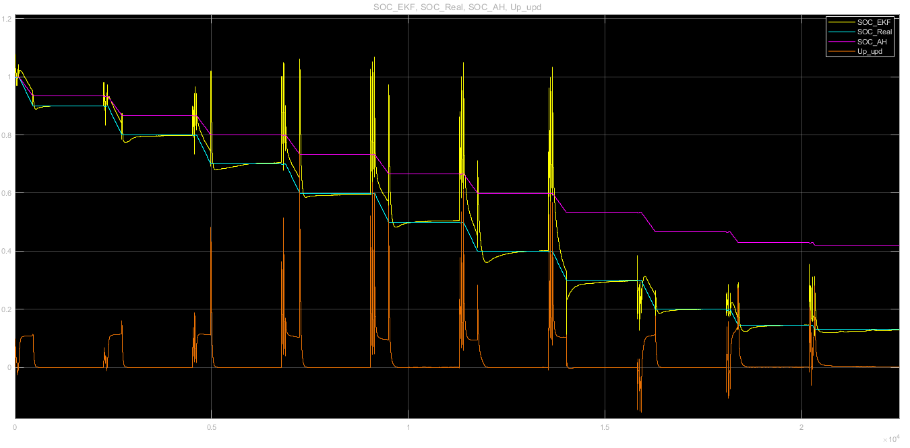
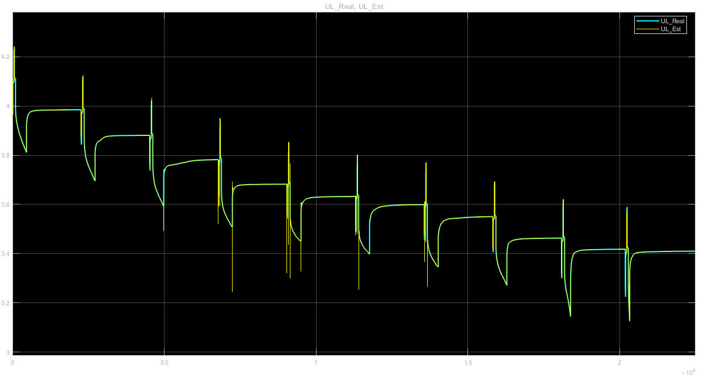
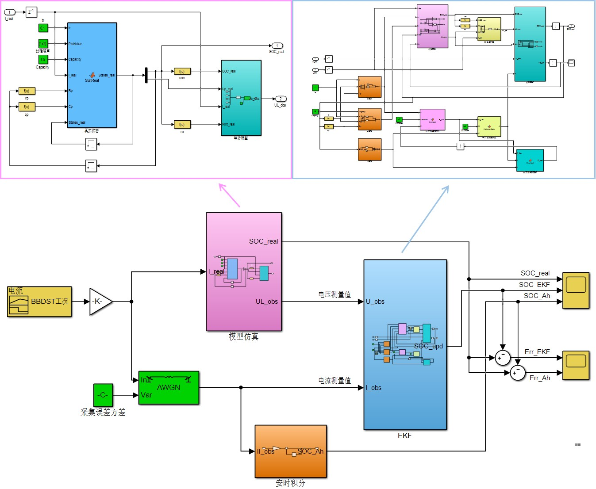
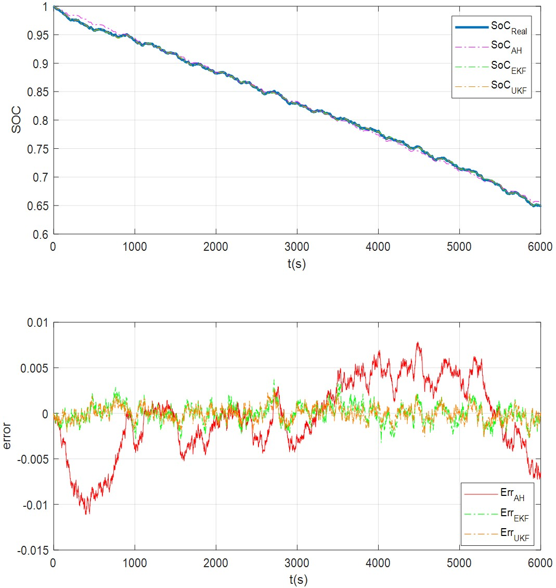

# Battery State of Charge Estimation Using Kalman Filter

---

This small project comes from the simulation part of my college graduation design which aimed to estimate the state of charge(SOC) of lithium battery. I mainly finished the experiments, parameters identification and simulation of extended kalman filter(EKF). The completion unscented kalman filter(UKF) simulation is thanks to the contribution from my friend, Pengcheng Gu. The BBDST working condition block is also benefit from the help of my senior, Cong Jiang.

## General Content

Li-Battery model building, parameters identification and verification, SOC estimation using extended kalman filter(EKF) through two ways:

1. Simulinks(EKF only)
2. Scripts(EKF&UKF)

## First Try

- The inputs of the model include current and voltage comes from battery data in HPPC(Hybrid PulsePower Characteristic) test.
- Thevenin equivalent circuit model and extended kalman filter are included in the simulation file "EKFSim_R2016.slx", of which the structure is shown in the snapshot below.


<p align="center">Structure of EKFSim_R2016.slx</p>

- The estimated curve has distinct divergences in the current pulse areas and it converges to the true value in the constant current discharge areas.
- The estimated SOC and update Up(voltage of RC element in Thevenin ECM) change synchronously due to the same state vector that they are in, that can be seen in the function block 'EKF'.


<p align="center">Output of EKFSim_R2016.slx</p>

- Kalman filter update of states including SOC and Up, according to the difference between observed values and predicted values of UL(voltage on the load). The code format of this expression is as following.  

```matlab
X_upd = X_pre + K*(UL_obs-UL_pre);
```


<p align="center">UL Variation</p>

## Improvement

- After improvement, the I/O relationship between modules becomes more perspicuous, the corresponding Simulink file is named Improved_EKFSim.slx.


<p align="center">Improved Structure</p>

- A Matlab script named "main.m", which runs the Matlab function in "EKF_UKF_Thev.m", has been created for simulation. It simulates discharge process of lithium-ion battery under the BBDST(Beijing Bus Dynamic Street Test) working condition and constant current working condition with observation noise, and uses EKF/UKF method to estimate SOC of the battery.

```matlab
function main(SOC_est_init, Work_modes)
```

- The same name function in "main.m" requires two arguments, SOC_est_init: The initial value of estimated SOC, it's set to 1 by default, Work_mode: Mode of working condition 1-BBDST, 2-constant current. If you give just on argument, it will be given to Work_mode.  
run the script in command window like `main()`or`main(1)`or`main(1,1)`, the result curves will appear as follows.


<p align="center">Script Result</p>
