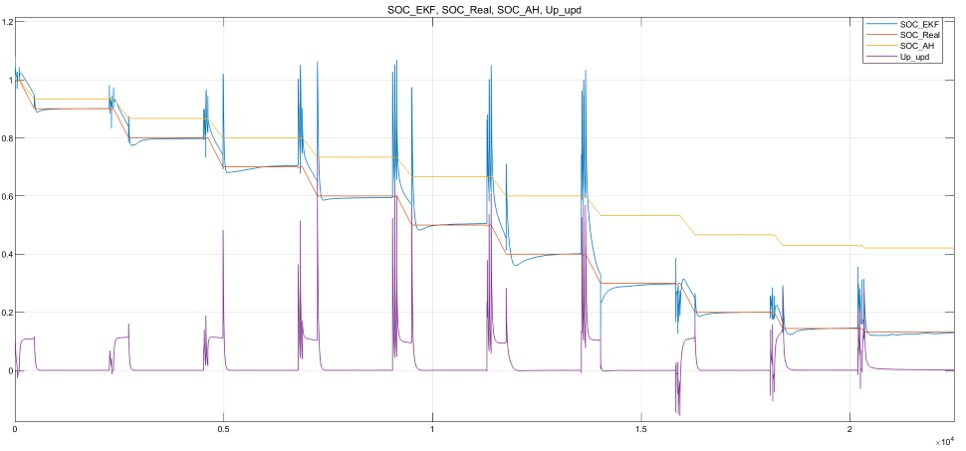
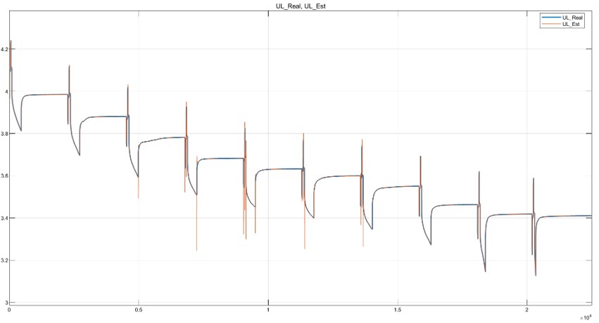
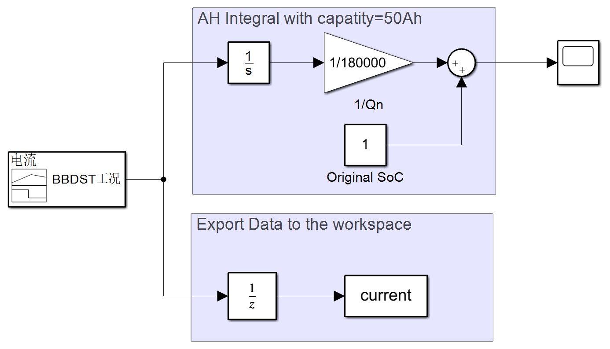
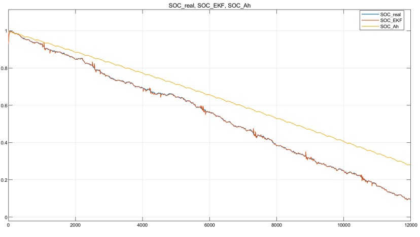
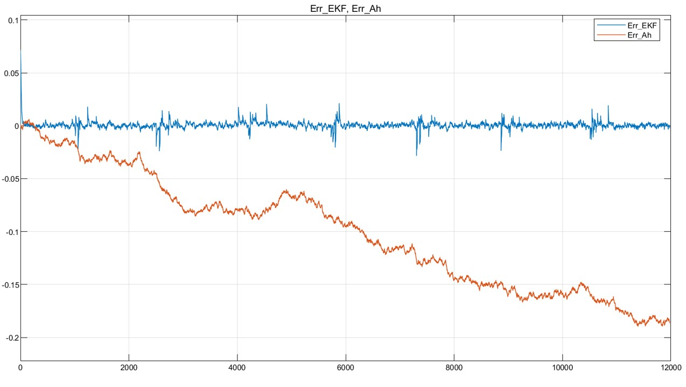

# Battery State of Charge Estimation Using Kalman Filter

[简体中文](./README_zh_CN.md)

This small project comes from the simulation part of my college graduation design which aimed to estimate the state of charge(SoC) of lithium battery. I mainly finished the experiments, parameters identification and simulation of extended kalman filter(EKF). The completion unscented kalman filter(UKF) simulation needs to thank the contribution from my friend, Pengcheng Gu. And the BBDST working condition block is also benefit from the help of my senior, Cong Jiang. 😘🔋thanks angain to my warm friends.🔋❤

## General Content

Li-Battery model building, parameters identification and verification, SoC estimation using extended kalman filter(EKF) through two ways:

1. Simulinks(EKF only)
2. Scripts(EKF&UKF)

## First Try

The inputs of the model include current and voltage comes from battery data in HPPC(Hybrid PulsePower Characteristic) test.

Thevenin equivalent circuit model and extended kalman filter are included in the simulation file "EKFSim_R2016.slx", of which the structure is shown in the snapshot below.


The estimated curve has distinct divergences in the current pulse areas and it converges to the true value in the constant current discharge areas.

The estimated SoC and update Up(voltage of RC element in Thevenin ECM) change synchronously due to the same state vector that they are in, that can be seen in the function block 'EKF'.

Kalman filter update of states including SoC and Up, according to the difference between observed values and predicted values of UL(voltage on the load). The code format of this expression is as following.  

```matlab
X_upd = X_pre + K*(UL_obs-UL_pre);
```

The output results of the simulation are shown in the figures belows.





## Improvement

After improvement, the I/O relationship between modules becomes more perspicuous, the corresponding Simulink file is named Improved_EKFSim.slx.


The BBDST(Beijing Bus Dynamic Street Test) working condition is used here as the input current.



The output results are shown in the figures belows.





## Scripts

MATLAB scripts simulate discharge process of lithium-ion battery under the BBDST working condition and constant current working condition with observation noise, and uses EKF/UKF method to estimate SoC of the battery.

```matlab
function main(Work_modes, SoC_est_init)
```

The main function requires two arguments:

- Work_mode: Choice of working condition with 1 representing BBDST working condition and 2 representing constant current.

- SoC_est_init: The initial value of estimated SoC, it's set to 1 by default, if just one argument is passed.

Type in command window like `main()`or`main(1)`or`main(1,1)`, the result curves will appear as follows.


## Related Knowledge

### 1. Thevenin equivalent circuit model

Thevenin equivalent circuit model(ECM) is a first-order RC circuit. The discharge direction is taken as the positive direction of current, as shown in the figure below.


The voltage on the polarization capacitor is denoted as Up. Then according to KVL and KCL we get the following equations.

```
UL(t) = UOC - Up(t) - Ro * I(t)              ······(1)
I(t) = Up(t) / Rp - Cp * (dUp(t)/dt)         ······(2)
```

The solution of the differential equation (2) is as follows.

```
Up(t) = C * exp(-t/tao) + I(t) * Rp          ······(3)
tao = Rp * Cp                                ······(4)
```
Here `C` is an arbitrary constant. The zero input response of the circuit model corresponds to the idle condition of the battery while zero state response corresponds to the working condition. The discretized form of Up in different states can be unified as follows.

```
Up(k+1) = Up(k) * exp(-Δt/tao) + 
          Rp * I(k) * (1 - exp(-Δt/tao))     ······(5)
```

Here `Δt` denotes the sample interval. The parameters in the Thevenin ECM, including `UOC`, `Ro`, `Rp` and `Cp`, are deemed to be related to the SoC of the battery. The relationships are usually identified through the so call Hybrid Pulse Power Characterization(HPPC) test.

### 2. Extended Kalman Filter

The basis of Kalman filter is the process of fusing the information from the prediction and the observation, under the hypothesis that the process error and the observation error are both stochastic noises, obeying Gaussian distributions. The EKF mainly consist of three steps: prediction, linearization and update.

```
_______________________________________________________
|                                                     |
|    |----------|     |-------------|     |------|    |
---->|prediction|---->|linearization|---->|update|-----
     |----------|     |-------------|     |------|
```

The prediction needs the knowledge of the state transition, expressed as equation (5) and (6), and observation estimate, expressed as equation (7) and (8).

```
SoC(k) = SoC(k-1) - eta/Qn * I(k-1)          ······(6)
UL(k) = UOC(k-1) - I(k-1) * Ro - Up(k-1)     ······(7)
UOC(k) = f(SoC(k-1))                         ······(8)
```

Here `eta` and `Qn` denote the coulombic efficiency and the rated capacity of the battery respectively. Let `X` be the state vector `[SoC, Up]'`, `A` be the state transformation matrix `[1, 0; 0, exp(-Δt/tao)]` and `B` be the input control matrix `[-eta/Qn, 0; 0, Rp*(1-exp(-Δt/tao))]`. Then equation (5) and (6) can be expressed as follows.

```
X(k) = A * X(k-1) + B * I(k-1)               ······(9)
```

The Kalman filter makes use of the process noise and observation noise for the state estimation. Then there's an important step of predicting the covariance of process error, expressed as `P`.

```
P(k) = A(k-1) * P(k-1) * A'(k-1) + Q        ······(10)
```

Here `Q` is a diagonal matrix containing the variances of the process noises. For the state `X=[SoC, Up]'`, `Q` is a 2x2 diagonal matrix `[Qs, 0; 0, Qu]`, in which `Qs` is the variances of process noises for `SoC` and `Qu` is that for `Up`.

Note that `UOC` is a nonlinear function of `SoC`, which makes the `UL=g(X, I)` is nonlinear. The linearization step is Taylor expanding `g(X, I)` around `X(k)` with first order approximation.

```
UL = g(X(k), I(k)) + əg/əX(k) * (X - X(k))  ······(11)
C(k) = əg/əX(k)
     = [əg/əSoC(k) əg/əUp(k)]
     = [ə(UoC-Ro*I(k))/əSoC(k) -1]          ······(12)
```

Hence `UL = C(k) * X + (g(X(k), I(k)) - C(k)*X(k))`. `C(k)` is a constant matrix and `(g(X(k), I(k)) - C(k)*X(k))` is a constant too. The linearization is completed.

Based on the result of linearization, the update step include updating the state vector and the covariance of process error by using the variance of observation noise `R` and observation value `UL_ob`.

```
K(k) = P(k) * C'(k) * 
       (C(k) * P(k) * C'(k) + R)^(-1)       ······(13)
X(k) = X(k) + K(k) * (UL_ob - UL(k))        ······(14)
P(k) = P(k) - K(k) * C(k) * P(k)            ······(15)
```

An Intuitive Derivation of the Kalman filter process is [Here](https://courses.engr.illinois.edu/ece420/sp2017/UnderstandingKalmanFilter.pdf). An detailed explanation of UKF is [Here](https://www.cs.ubc.ca/~murphyk/Papers/Julier_Uhlmann_mar04.pdf).
